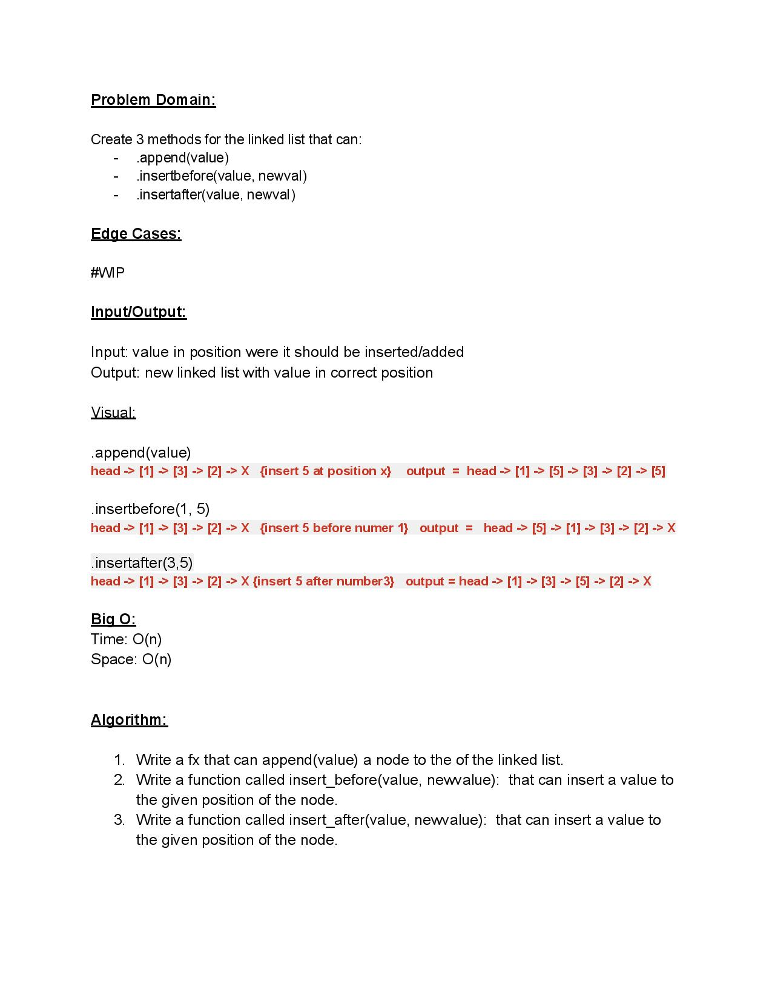

# Challenge Summary
Extend a Linked List to allow various insertion methods.

## Whiteboard Process

## Approach & Efficiency
<!-- What approach did you take? Why? What is the Big O space/time for this approach? -->

## Solution
<!-- Show how to run your code, and examples of it in action -->

## Credits and Collaborators
Used for .append():
https://stackoverflow.com/questions/28315201/python-linked-list-append/51799529