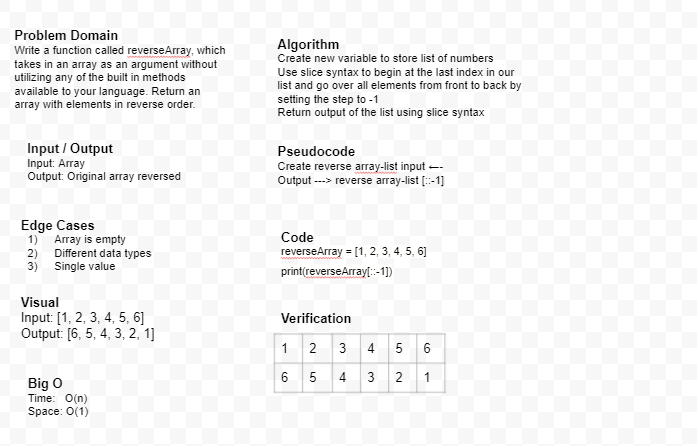

# Reverse an Array
Write a function called reverseArray which takes an array as an argument. Without utilizing any of the built-in methods available to your language, return an array with elements in reversed order.

## Whiteboard Process

## Approach & Efficiency
Refered back to pre-work for big O help and slice sytax.

Also, Ben was super helpful!

# Collaborated With

Daniel Dills
Ben Hills